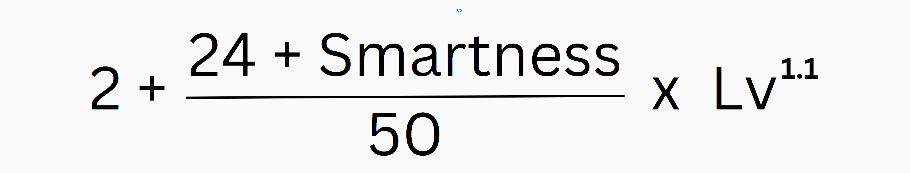

# Earn Rate & Stats

## Stats

Each Weber NFT has two types of stats:&#x20;

* **Static Stats** are fixed.
* **Progressive Stats** are computed from static stats and other NFT properties.

### Static Stats

* **Smartness \[S]:** Impacts the daily reward cap.
* **Vitality \[V]:** Impacts stamina consumption.
* **Dexterity \[D]:** Impacts earning speed.
* **Curiosity \[C]:** Impacts the rate of experience accumulation.
* **Grace \[G]:** May impact places related to probability.

****

#### Static Stats Value Range

When a Weber NFT is minted, static stats will be assigned a value within a range that depends on the NFT Tier. All three static stats share the same value ranges based on the NFT Tier.

<table data-view="cards"><thead><tr><th>Tier</th><th>Max Stats</th><th>Min Stats</th></tr></thead><tbody><tr><td>1</td><td>8</td><td>3</td></tr><tr><td>2</td><td>16</td><td>8</td></tr><tr><td>3</td><td>28</td><td>16</td></tr></tbody></table>

### Progressive Stats

**Daily Reward Cap**

There is a daily reward cap for each Weber NFT, which is computed by the following formula:

<figure><figcaption></figcaption></figure>

**Stamina Consumption**

For every real-knowledge gain time users spend on UrWeb, equipped NFTs will consume stamina.  The amount of stamina consumed per minute is computed from the following formula:

<figure><figcaption></figcaption></figure>

Where A = 0.0006, B = -0.035, C = 1.3, D = 0.005

#### Rate of Experience Accumulation&#x20;

For every validated real-knowledge task or contribution users submit on UrWeb until the daily reward cap is met, the equipped Weber NFT will accumulate experience (RXP). The amount of RXP per time spent and impact is computed based on the following formula:

<figure><figcaption></figcaption></figure>

where:

* UCS = User Contribution Score
* TCS = Total Contribution Score
* RAM = Real Activity Multiplier

By including the Real Activity Multiplier, this formula ensures that users are only rewarded for their contributions if they are actively engaging with the platform and performing real activities, rather than simply passively accumulating EXP.

**Earning Speed**

For every real-knowledge gain hour users spend on UrWeb, they will accumulate $URWEB, up to the daily earning cap of the Weber.

<figure><figcaption></figcaption></figure>

## **Multiple** Weber **NFT Stacking**

For users with multiple Weber NFTs, only one pair can be equipped at a time as the Primary NFT. All other pairs of Weber will be displayed in the user’s inventory and will accumulate $URWEB and RXP at the reduced rate shown below.

<table data-view="cards"><thead><tr><th>No. of NFTs in Inventory</th><th>Reduction Ratio</th></tr></thead><tbody><tr><td>2-3</td><td>0.7</td></tr><tr><td>4-7</td><td>0.5</td></tr><tr><td>8-11</td><td>0.3</td></tr><tr><td>12-15</td><td>0.15</td></tr><tr><td>16+</td><td>0.1</td></tr></tbody></table>

