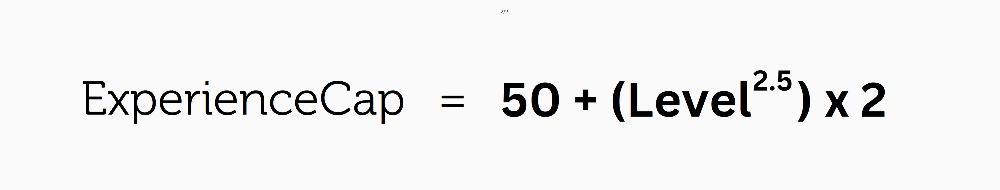
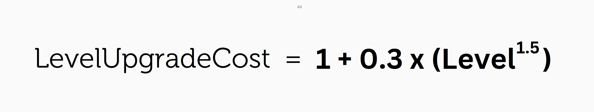

# Levels, Tiers, and EXP

Each Weber NFT starts at level 0 and can be upgraded once the experience cap is met.

<figure><figcaption></figcaption></figure>

For each real-knoeledge gain when the user earns $URWEB, the equipped pair of Weber will gain 5 experience (RXP) points. When the daily reward cap has been reached, the user will stop earning RXP for that day.

When the experience cap is reached for a certain level, users can choose to upgrade the Weber NFT level at the cost of $URWEB tokens. The cost to upgrade is dependent on the current level of the Weber NFT.

<figure><figcaption></figcaption></figure>

Weber NFTs can be upgraded up to the level cap, which is different for each Tier.

<table data-view="cards"><thead><tr><th>Tier</th><th>Level Cap</th></tr></thead><tbody><tr><td>1</td><td>35</td></tr><tr><td>2</td><td>70</td></tr><tr><td>3</td><td>100</td></tr></tbody></table>
